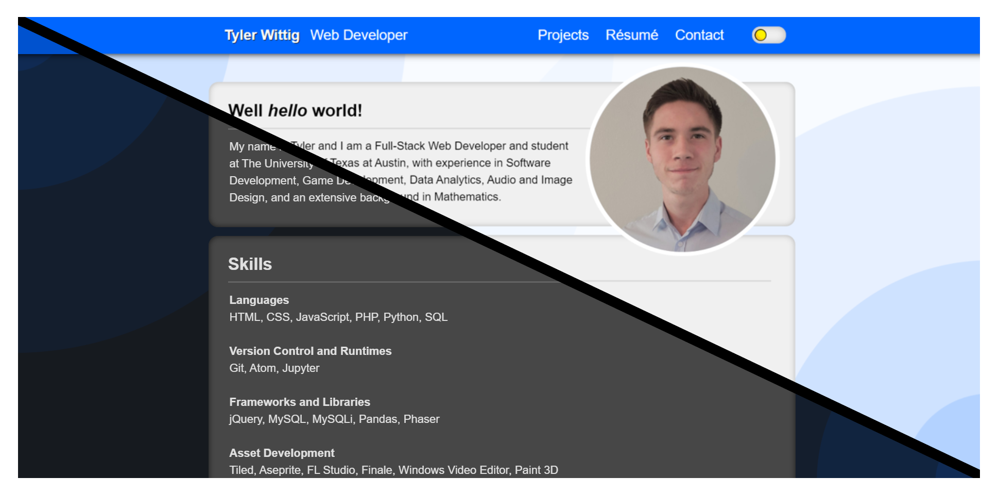

<!-- Title -->
<h1 align="center">First Portfolio Website (2020)</h1>
 

<!-- Image -->

  

<!-- Description -->

  <b>Static Portfolio Website Project</b>

  Serving as a playground for HTML, CSS, and JavaScript as I learned more about web development, 
  this static portfolio website underwent numerous design changes and refactors in its time active.

<!-- Links -->

  <a href="./index.html">View Website</a>

