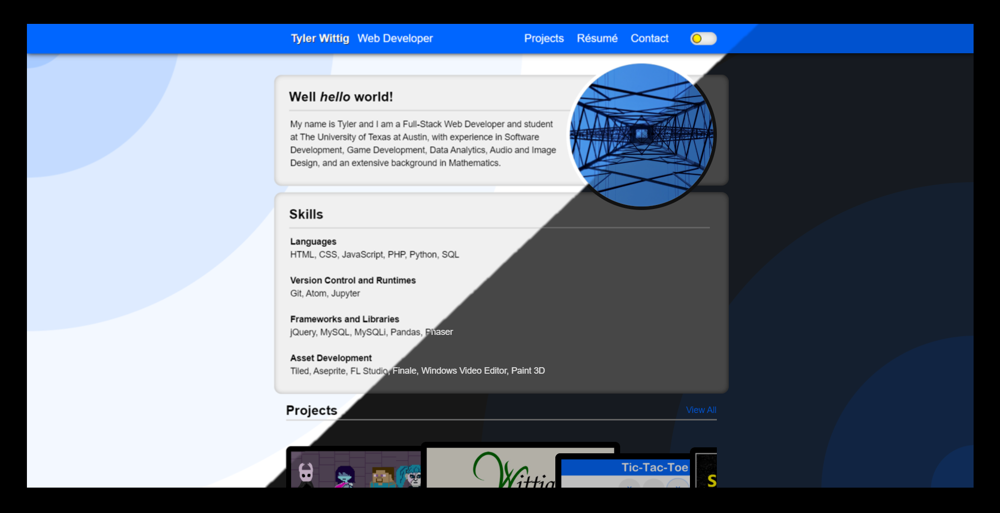

# First Portfolio Website (2020)
<figure style="text-align:center;">
  
  <figcaption style="font-style:italix;">Static Portfolio Website Project</figcaption>
</figure>

  Serving as a playground for HTML, CSS, and JavaScript as I learned more about web development, 
  this static portfolio website underwent numerous design changes and refactors in its time active.

